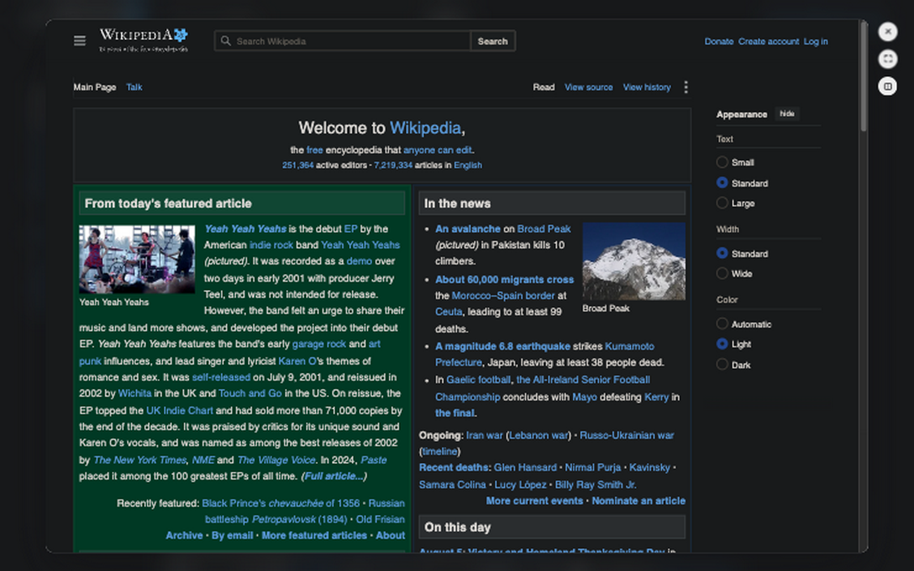
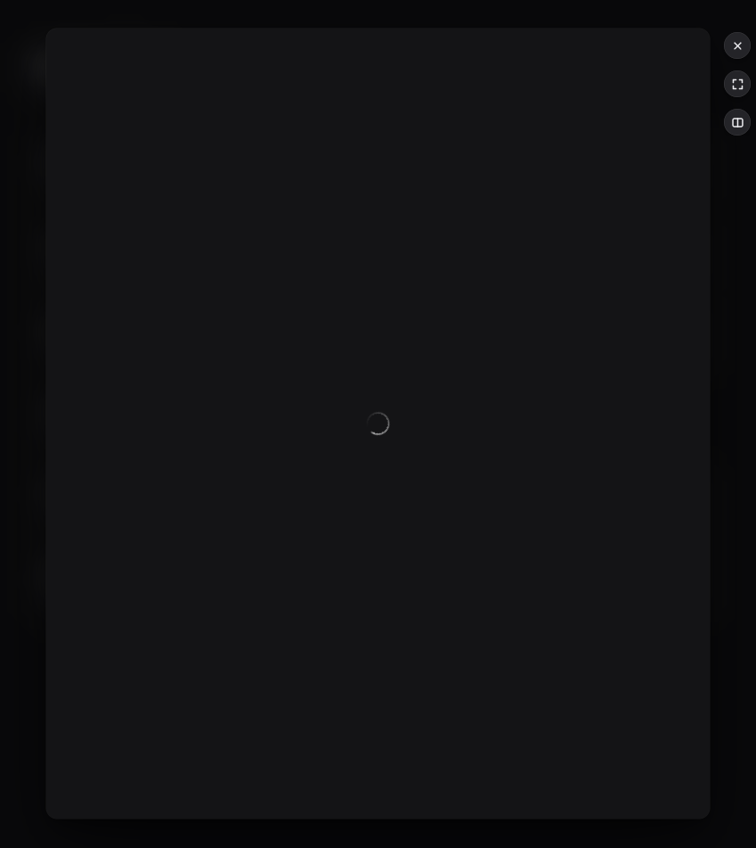
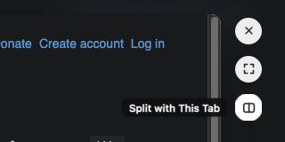
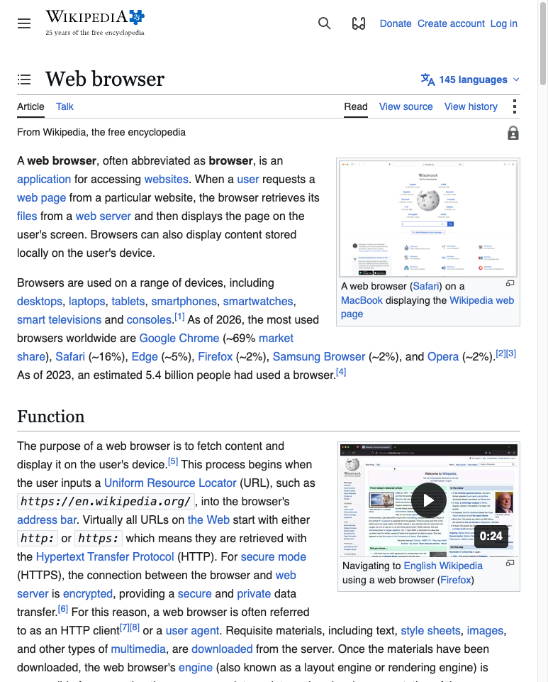
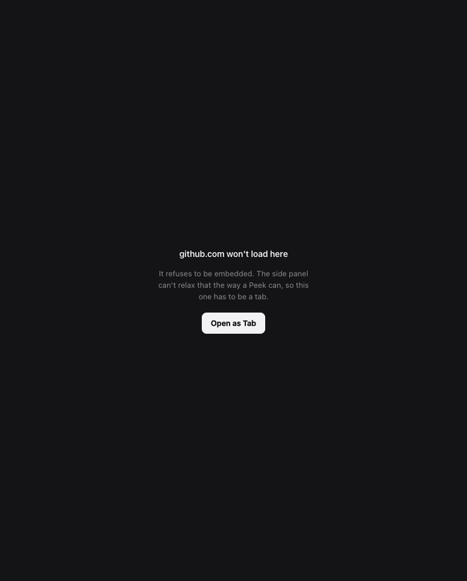
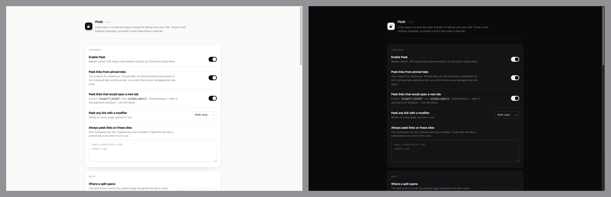

# Peek

Arc's Peek, rebuilt as a Chromium extension. Click a link in a pinned tab and it
opens in a preview layer over the page instead of navigating your tab away.
Dismiss it and nothing changed. Promote it and it becomes a real tab.



Works in any Chromium browser on Manifest V3. Built and verified against
**Aside** (Chromium 150).

---

## Contents

- [Install](#install)
- [Using it](#using-it)
  - [Opening a Peek](#opening-a-peek)
  - [The three buttons](#the-three-buttons)
  - [Split](#split)
  - [Keyboard](#keyboard)
- [Settings](#settings)
- [How it works](#how-it-works)
- [Project layout](#project-layout)
- [Development](#development)

---

## Install

Load the folder as an unpacked extension. That's the whole install — Peek is
plain JavaScript with nothing to compile.

```bash
git clone https://github.com/lukabirac/peek.git
```

1. Open `chrome://extensions`
2. Turn on **Developer mode** (top right)
3. Click **Load unpacked** and select the folder you just cloned

Same steps in Edge, Brave, Dia, Comet, and Aside — only the URL changes
(`edge://extensions`, `aside://extensions`, and so on).

<details>
<summary>Loading it in Aside without touching the UI</summary>

Aside runs with remote debugging on `:9222`, so it can be installed and
hot-reloaded from the shell:

```bash
node tools/install.mjs
```

That calls `Extensions.loadUnpacked` over the DevTools Protocol and prints the
extension id. Run it again after an edit to reload — content scripts re-inject
on the next page load. It needs the browser-level debugging socket, so it won't
work while another client (an agent session, an attached debugger) is holding
it; use the **Reload** button on the extensions page in that case.

</details>

---

## Using it

Peek exists to make one thing cheap: looking at a link without committing to it.
The transient case is the default; persistence is the deliberate act.

### Opening a Peek

| Trigger | Default |
|---|---|
| Click a link in a **pinned tab** | on |
| **Shift-click** any link, anywhere | on |
| `target="_blank"` or `window.open()` from a pinned tab | on |
| Right-click → **Peek Link** | always |
| <kbd>⌥</kbd><kbd>⇧</kbd><kbd>P</kbd> with the cursor over a link | always |
| Any link on a site in your allowlist | off until you add one |

⌘-click, middle-click and sized popups keep their normal meaning. Links to the
page you're already on and download links are never peeked.

One Peek at a time, as in Arc. Opening another replaces it. Navigating inside a
Peek stays inside the Peek and never touches the tab's history.

While a page is still loading, the pane shows a single quiet ring — no progress
bar, no title, no chrome:



### The three buttons

The only chrome in a Peek is a rail of three round buttons on the scrim, just
outside the pane's top-right corner.



| | |
|---|---|
| **✕** | Close. Nothing about your session changed. |
| **⛶** | Open as Tab — promotes the Peek to a real tab, inserted right after the current one. |
| **▯▯** | Split with This Tab — puts the peeked page beside the tab it came from, in the same window. |

Clicking the scrim, pressing <kbd>Esc</kbd>, or swiping also dismisses. The
swipe is a two-finger gesture that throws the pane off the side of the screen,
always travelling with your fingers rather than against them. Two settings
govern it, because a swipe asks two separate questions: **Natural scrolling**
has to match your system setting, since nothing reports it to a page and
getting it wrong inverts everything; **Which way you swipe** is then just taste.
Back at the first page of a Peek's own history dismisses too, rather than
dead-ending on a disabled button.

### Split

Split sends the peeked page into Chromium's side panel — a resizable pane beside
the page, inside the same window — and closes the Peek.



Aside and recent Chromium both ship a real side-by-side split, but **no extension
can start one**: `tabs.splitViewId` is exposed read-only, and the calls that
create or manipulate a split (`isActiveTabInSplit`, `swapWindowsInSplitView`)
live in `*Private` namespaces reserved for the browser's own components. The
side panel is the closest surface an extension is actually allowed to drive.

The button is the one control that is not part of the extension's shadow DOM.
`chrome.sidePanel.open()` may only be called in response to a user gesture, and a
gesture does not survive the hop from a content script to the service worker — by
the time the worker runs, the activation is spent. So the split button is a 30×30
`chrome-extension://` document layered into the rail: the click lands in a context
that genuinely holds activation, and `open()` is called directly in the handler.
See [`src/rail/split-button.js`](src/rail/split-button.js).

If the panel can't render a site, it says so rather than showing Chromium's
error page:



`splitMode: "window"` in settings restores the older behaviour: halve the current
window and open the page in a new one beside it.

### Keyboard

**Inside an open Peek:**

| | |
|---|---|
| <kbd>Esc</kbd> | Dismiss |
| <kbd>⌘</kbd><kbd>↩</kbd> | Open as a tab |
| <kbd>⌘</kbd><kbd>[</kbd> / <kbd>⌘</kbd><kbd>]</kbd> | Back / forward within the Peek's own history |
| <kbd>⌘</kbd><kbd>⇧</kbd><kbd>C</kbd> | Copy the link |
| <kbd>⌘</kbd>-click a link inside the Peek | Escape it into a real tab |

**Browser-level commands**, rebindable at `chrome://extensions/shortcuts`. Each
one only does something when its precondition is met, and does nothing at all
otherwise — there is no error, no flash, no sound:

| | Requires | What it does |
|---|---|---|
| <kbd>⌥</kbd><kbd>⇧</kbd><kbd>P</kbd> | The mouse cursor resting **on a link** | Peeks that link. Point at a link without clicking, then press it — no Peek needs to be open. Ignores links to the current page and download links. |
| <kbd>⌥</kbd><kbd>⇧</kbd><kbd>O</kbd> | A Peek **already open** | Promotes it to a real tab. Same as <kbd>⌘</kbd><kbd>↩</kbd>, but works even when focus has drifted out of the Peek. |
| <kbd>⌥</kbd><kbd>⇧</kbd><kbd>S</kbd> | A Peek **already open** | Splits it beside the current tab. Same as the split button. |

Splitting has a browser-level shortcut rather than an in-Peek chord for the same
reason the button is an extension frame: a `commands.onCommand` handler carries
user activation, and a keystroke the page handled does not.

---

## Settings

Click the toolbar icon, or `chrome://extensions` → Peek → Details → Extension
options.



| Setting | Default | What it does |
|---|---|---|
| `enabled` | on | Master switch. Off means links behave exactly as Chromium ships them. |
| `onPinnedTabs` | on | Clicks in a pinned tab peek instead of navigating. |
| `peekNewTabLinks` | on | Route `target="_blank"` and `window.open()` into a Peek. Sized popups — sign-in, payment — are left alone. |
| `modifier` | `shift` | Modifier that peeks any link on any page. `shift` \| `alt` \| `none`. |
| `allowlist` | `[]` | Hostnames treated like a pinned tab. Subdomains included. |
| `splitMode` | `sidePanel` | `sidePanel` (one window) or `window` (two tiled windows). |
| `prefetch` | on | Start loading on pointer-down rather than click. |
| `dismissOnSwipe` | on | Two-finger swipe to dismiss. Rubber-banded, with a fling threshold. |
| `naturalScrolling` | on | Match your system's trackpad setting. It decides which way a swipe is *reported*, and no API exposes it — get it wrong and the pane runs away from your fingers. |
| `swipeDirection` | `right` | The direction you move your fingers to dismiss. The pane always travels with them. `right` \| `left`. |
| `reducedEffects` | off | Drop the backdrop blur. Worth it on integrated graphics. |

Peek suspends `X-Frame-Options` and CSP `frame-ancestors` so a preview can load
at all. Those rules are session-scoped, conditioned on the single tab holding the
Peek, matched to sub-frame requests only, and withdrawn the moment the Peek
closes. Nothing is relaxed globally or persistently.

---

## How it works

```
src/content/peek-host.js        top frame: triggers, overlay, animation, history
src/content/peek-child.js       every frame: reports state up, runs commands down
src/content/peek-main-world.js  window.open() shim
src/content/peek-styles.js      the whole visual layer, as one stylesheet
src/rail/split-button.*         the split button, in its own extension document
src/sidepanel/panel.*           the split target
src/background/service-worker.js  tab context, header rules, promote / split
```

Four details carry most of the weight.

**Top layer, not z-index.** The overlay is a `<dialog>` opened with `showModal()`
inside a *closed* shadow root on a `<peek-root>` element appended to
`documentElement`. That puts it above anything the page can construct, makes the
page behind genuinely inert, and gives a real `::backdrop` to blur. No z-index
war, no style leakage in either direction. It hangs off `documentElement` rather
than `body` because pages transform `<body>` often enough that a fixed child
would get trapped in the wrong containing block.

**A child bridge, because cross-origin frames are opaque.** The host can't read
the peeked page's URL, title or history, and can't call `history.back()` on it.
So `peek-child.js` runs in every frame, stays completely silent until the host
addresses it by a per-Peek token, and then reports state upward and executes
navigation downward. The host rebuilds the Peek's session history from those
reports — which is what makes *back-at-root dismisses* possible, and what tells
the side panel whether a page actually rendered or whether it's looking at
Chromium's "refused to connect" document.

**Warming on pointer-down.** The Peek is built and the document starts loading on
mouse *down*, into a dialog that is `show()`n non-modally, fully transparent and
`inert`. By mouse *up* — roughly 100 ms later, plus the open animation — the page
has usually already painted, so revealing it is a compositor swap rather than a
first paint. The subtree has to opt out of hit-testing while priming, or the
invisible pane swallows the very mouseup that is supposed to trigger the Peek.

**Motion is a real spring.** Stiffness 260, damping 26, mass 1, solved offline and
baked into a CSS `linear()` easing with ~1.4% overshoot — enough to feel physical,
never enough to look bouncy. Opening grows from the point you clicked; closing is
the exact inverse and faster, because a cheap exit is what makes people willing to
open Peeks liberally.

---

## Project layout

```
manifest.json                 MV3 manifest
src/background/               service worker
src/content/                  content scripts (host, child, main-world shim, styles, icons)
src/rail/                     the split button's extension document
src/sidepanel/                the split target
src/options/                  settings page
src/icons/                    toolbar icons
tools/install.mjs             CDP hot-reload installer
tools/make-icons.py           regenerates src/icons/*.png
tools/harness.html            test fixture
docs/                         screenshots used by this README
```

## Development

```bash
node --check src/content/peek-host.js   # syntax-check any file directly
node tools/install.mjs                  # hot-reload into Aside
python3 -m http.server 7391 --bind 127.0.0.1 --directory tools   # test fixture
python3 tools/make-icons.py             # regenerate icons
```

The stylesheet lives inside a JS template literal in `peek-styles.js` so it can be
injected into a closed shadow root with no extra fetch. Backticks inside CSS
comments will break the file — `node --check` catches it.
